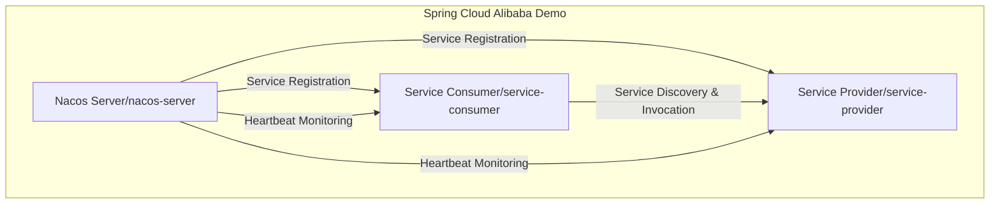

# spring-cloud-alibaba-demo

一个小 demo 用来学习 Spring Boot + Spring Cloud Alibaba 开发分布式微服务。

## Spring Cloud Alibaba 介绍

## 技术栈

- [X] 服务注册和服务发现：Nacos Discovery
- [X] 客户端负载均衡：Spring Cloud LoadBalancer
- [X] 服务调用：RestClient + LoadBalancer
- [ ] 客户端负载均衡：Dubbo
- [ ] 服务调用：Dubbo
- [X] 数据库持久层: Spring Data JPA
- [X] 数据库：H2
- [X] 数据库连接池：HikariCP
- [ ] 服务监控：Actuator
- [ ] 配置管理：Nacos Config
- [ ] 服务熔断、降级：Sentinel
- [ ] 服务网关：Spring Cloud Gateway
- [ ] 异步消息：Spring Cloud Stream
- [ ] 消息队列：Kafka

## 服务列表

- nacos-server, 端口：8848
- service-provider, 端口：8081
- service-consumer, 端口：8082

## 调用关系

